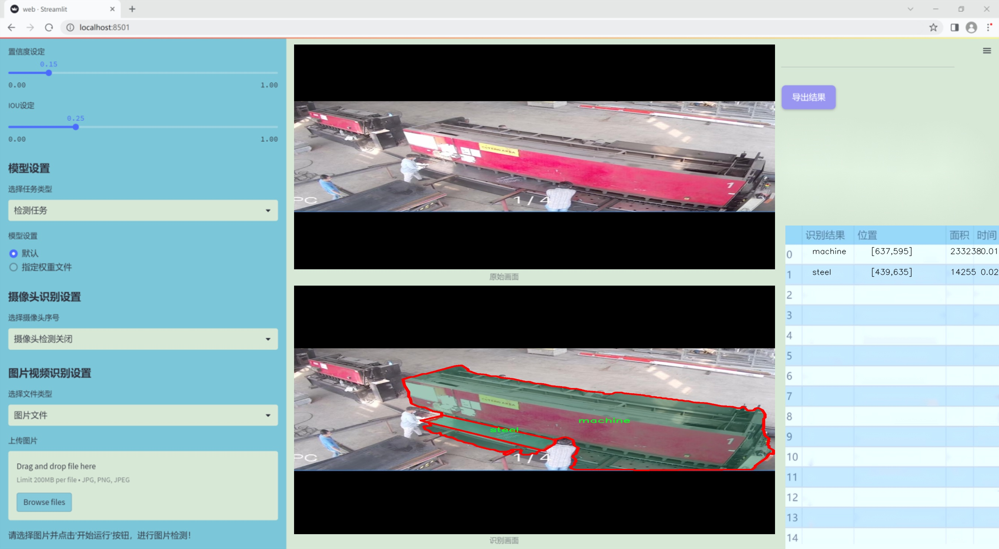
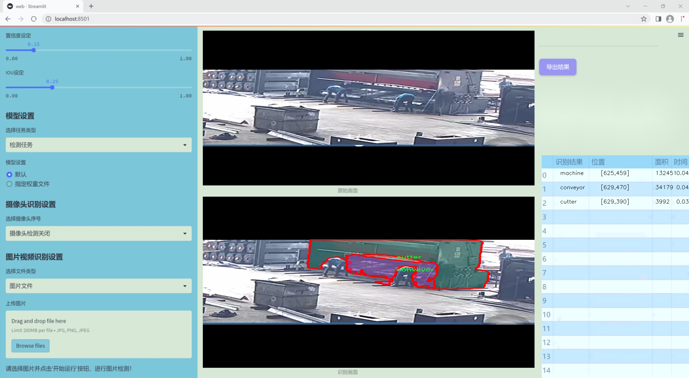
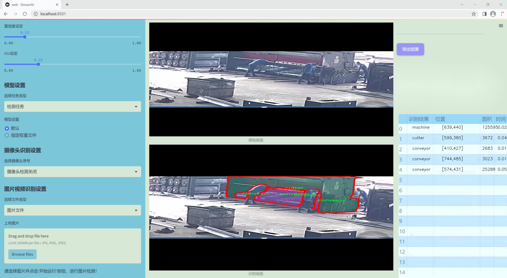
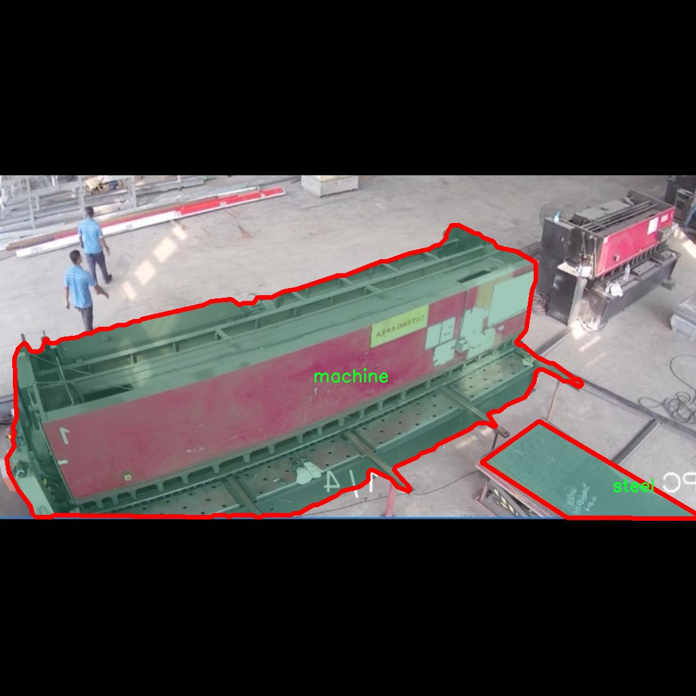
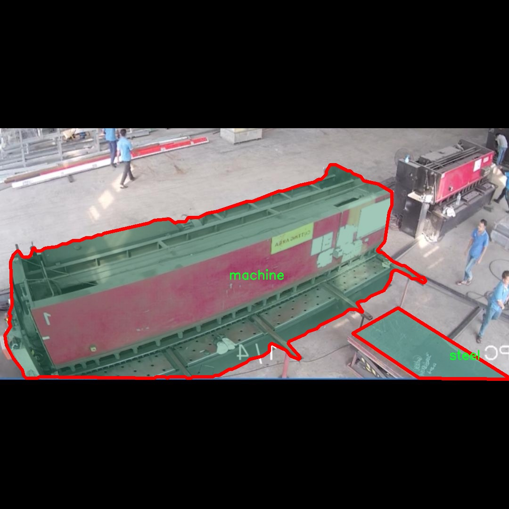
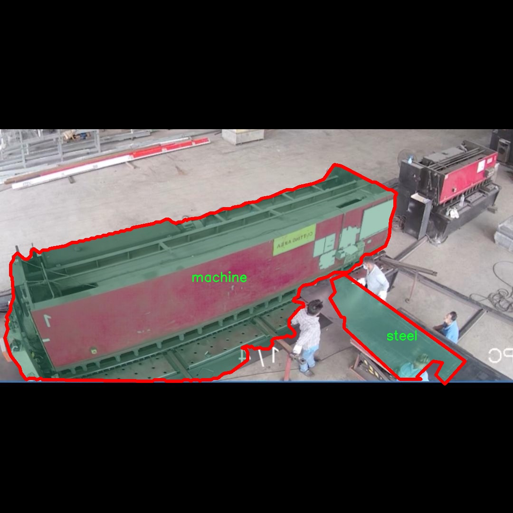
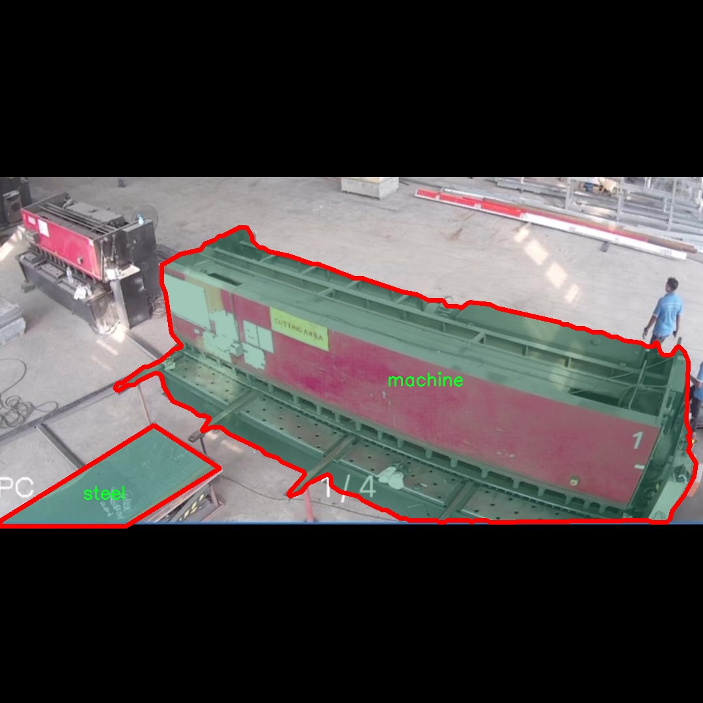

# 改进yolo11-EMSC等200+全套创新点大全：制造业工厂机械设备检测系统源码＆数据集全套

### 1.图片效果展示







##### 项目来源 **[人工智能促进会 2024.10.22](https://kdocs.cn/l/cszuIiCKVNis)**

##### 注意：由于项目一直在更新迭代，上面“1.图片效果展示”和“2.视频效果展示”展示的系统图片或者视频可能为老版本，新版本在老版本的基础上升级如下：（实际效果以升级的新版本为准）

  （1）适配了YOLOV11的“目标检测”模型和“实例分割”模型，通过加载相应的权重（.pt）文件即可自适应加载模型。

  （2）支持“图片识别”、“视频识别”、“摄像头实时识别”三种识别模式。

  （3）支持“图片识别”、“视频识别”、“摄像头实时识别”三种识别结果保存导出，解决手动导出（容易卡顿出现爆内存）存在的问题，识别完自动保存结果并导出到tempDir中。

  （4）支持Web前端系统中的标题、背景图等自定义修改。

  另外本项目提供训练的数据集和训练教程,暂不提供权重文件（best.pt）,需要您按照教程进行训练后实现图片演示和Web前端界面演示的效果。

### 2.视频效果展示

[2.1 视频效果展示](https://www.bilibili.com/video/BV1A7yZYXE26/)

### 3.背景

研究背景与意义

随着制造业的快速发展，机械设备的自动化和智能化水平不断提高，如何有效地监测和管理工厂内的机械设备成为了行业关注的焦点。传统的设备检测方法往往依赖人工巡检，不仅效率低下，而且容易受到人为因素的影响，导致设备故障的延误发现。因此，开发一种高效、准确的机械设备检测系统显得尤为重要。基于此背景，本文提出了一种改进的YOLOv11模型，用于制造业工厂机械设备的实时检测。

在本研究中，我们使用了包含208张图像的数据集，涵盖了两个主要类别：传送带（conveyor）和切割机（cutter），以及其他相关机械设备。这些设备在生产过程中扮演着至关重要的角色，其正常运行直接影响到生产效率和产品质量。通过应用YOLOv11这一先进的目标检测算法，我们能够实现对这些设备的快速识别和定位，从而为后续的智能监控和维护提供数据支持。

此外，改进YOLOv11模型的引入，不仅提升了检测的准确性和速度，还增强了系统在复杂环境下的鲁棒性。这一创新的检测系统能够实时捕捉设备状态，及时发现潜在故障，减少停机时间，降低维护成本，进而提高整体生产效率。通过对机械设备的智能监测，我们能够实现更为精细化的管理，推动制造业向智能化、数字化转型。

综上所述，基于改进YOLOv11的机械设备检测系统，不仅为制造业提供了一种新的技术手段，也为相关研究提供了新的思路，具有重要的理论价值和实际应用意义。

### 4.数据集信息展示

##### 4.1 本项目数据集详细数据（类别数＆类别名）

nc: 4
names: ['conveyor', 'cutter', 'machine', 'steel']


该项目为【图像分割】数据集，请在【训练教程和Web端加载模型教程（第三步）】这一步的时候按照【图像分割】部分的教程来训练

##### 4.2 本项目数据集信息介绍

本项目数据集信息介绍

本项目所使用的数据集名为“assem”，旨在为改进YOLOv11的制造业工厂机械设备检测系统提供支持。该数据集专注于制造业领域，特别是机械设备的检测与识别，涵盖了四个主要类别：传送带（conveyor）、切割机（cutter）、机械（machine）和钢材（steel）。这些类别的选择反映了现代制造业中常见的设备与材料，能够有效地帮助模型学习和识别工厂环境中的关键元素。

“assem”数据集的构建过程经过精心设计，确保数据的多样性和代表性。数据集中包含了大量的图像样本，这些样本在不同的工厂环境、光照条件和视角下拍摄，旨在提高模型的鲁棒性和泛化能力。每个类别的图像都经过标注，确保在训练过程中模型能够准确地学习到各个类别的特征。通过使用该数据集，模型不仅能够识别出特定的机械设备，还能在复杂的工厂环境中有效区分不同类型的设备和材料。

在训练过程中，数据集的多样性将有助于提升YOLOv11的检测精度，使其能够在实际应用中更好地适应各种场景。这对于提高制造业的自动化水平和生产效率具有重要意义。此外，数据集的设计也考虑到了未来的扩展性，允许研究人员在后续的工作中添加更多类别或样本，以不断提升模型的性能和适用范围。

总之，“assem”数据集为本项目提供了坚实的基础，旨在通过深度学习技术的应用，推动制造业机械设备检测系统的智能化发展。










### 5.全套项目环境部署视频教程（零基础手把手教学）

[5.1 所需软件PyCharm和Anaconda安装教程（第一步）](https://www.bilibili.com/video/BV1BoC1YCEKi/?spm_id_from=333.999.0.0&vd_source=bc9aec86d164b67a7004b996143742dc)


[5.2 安装Python虚拟环境创建和依赖库安装视频教程（第二步）](https://www.bilibili.com/video/BV1ZoC1YCEBw?spm_id_from=333.788.videopod.sections&vd_source=bc9aec86d164b67a7004b996143742dc)

### 6.改进YOLOv11训练教程和Web_UI前端加载模型教程（零基础手把手教学）

[6.1 改进YOLOv11训练教程和Web_UI前端加载模型教程（第三步）](https://www.bilibili.com/video/BV1BoC1YCEhR?spm_id_from=333.788.videopod.sections&vd_source=bc9aec86d164b67a7004b996143742dc)


按照上面的训练视频教程链接加载项目提供的数据集，运行train.py即可开始训练



     Epoch   gpu_mem       box       obj       cls    labels  img_size
     1/200     20.8G   0.01576   0.01955  0.007536        22      1280: 100%|██████████| 849/849 [14:42<00:00,  1.04s/it]
               Class     Images     Labels          P          R     mAP@.5 mAP@.5:.95: 100%|██████████| 213/213 [01:14<00:00,  2.87it/s]
                 all       3395      17314      0.994      0.957      0.0957      0.0843

     Epoch   gpu_mem       box       obj       cls    labels  img_size
     2/200     20.8G   0.01578   0.01923  0.007006        22      1280: 100%|██████████| 849/849 [14:44<00:00,  1.04s/it]
               Class     Images     Labels          P          R     mAP@.5 mAP@.5:.95: 100%|██████████| 213/213 [01:12<00:00,  2.95it/s]
                 all       3395      17314      0.996      0.956      0.0957      0.0845

     Epoch   gpu_mem       box       obj       cls    labels  img_size
     3/200     20.8G   0.01561    0.0191  0.006895        27      1280: 100%|██████████| 849/849 [10:56<00:00,  1.29it/s]
               Class     Images     Labels          P          R     mAP@.5 mAP@.5:.95: 100%|███████   | 187/213 [00:52<00:00,  4.04it/s]
                 all       3395      17314      0.996      0.957      0.0957      0.0845


###### [项目数据集下载链接](https://kdocs.cn/l/cszuIiCKVNis)

### 7.原始YOLOv11算法讲解


ultralytics发布了最新的作品YOLOv11，这一次YOLOv11的变化相对于ultralytics公司的上一代作品YOLOv8变化不是很大的（YOLOv9、YOLOv10均不是ultralytics公司作品），其中改变的位置涉及到C2f变为C3K2，在SPPF后面加了一层类似于注意力机制的C2PSA，还有一个变化大家从yaml文件是看不出来的就是它的检测头内部替换了两个DWConv，以及模型的深度和宽度参数进行了大幅度调整，但是在损失函数方面就没有变化还是采用的CIoU作为边界框回归损失，下面带大家深入理解一下ultralytics最新作品YOLOv11的创新点。

**下图为最近的YOLO系列发布时间线！**


* * *

###### YOLOv11和YOLOv8对比

在YOLOYOLOv5，YOLOv8，和YOLOv11是ultralytics公司作品（ultralytics出品必属精品），下面用一张图片从yaml文件来带大家对比一下YOLOv8和YOLOv11的区别，配置文件变得内容比较少大家可以看一卡，左侧为YOLOv8右侧为YOLOv11，不同的点我用黑线标注了出来。


* * *

###### YOLOv11的网络结构解析

下面的图片为YOLOv11的网络结构图。


**其中主要创新点可以总结如下- > **

* * *

1\.
提出C3k2机制，其中C3k2有参数为c3k，其中在网络的浅层c3k设置为False（下图中可以看到c3k2第二个参数被设置为False，就是对应的c3k参数）。


此时所谓的C3k2就相当于YOLOv8中的C2f，其网络结构为一致的，其中的C3k机制的网络结构图如下图所示
**（为什么叫C3k2，我个人理解是因为C3k的调用时C3k其中的参数N固定设置为2的原因，个人理解不一定对** ）。


* * *

2\.
第二个创新点是提出C2PSA机制，这是一个C2（C2f的前身）机制内部嵌入了一个多头注意力机制，在这个过程中我还发现作者尝试了C2fPSA机制但是估计效果不如C2PSA，有的时候机制有没有效果理论上真的很难解释通，下图为C2PSA机制的原理图，仔细观察把Attention哪里去掉则C2PSA机制就变为了C2所以我上面说C2PSA就是C2里面嵌入了一个PSA机制。


* * *

3\.
第三个创新点可以说是原先的解耦头中的分类检测头增加了两个DWConv，具体的对比大家可以看下面两个图下面的是YOLOv11的解耦头，上面的是YOLOv8的解耦头.


我们上面看到了在分类检测头中YOLOv11插入了两个DWConv这样的做法可以大幅度减少参数量和计算量（原先两个普通的Conv大家要注意到卷积和是由3变为了1的，这是形成了两个深度可分离Conv），大家可能不太理解为什么加入了两个DWConv还能够减少计算量，以及什么是深度可分离Conv，下面我来解释一下。

> **`DWConv` 代表 Depthwise
> Convolution（深度卷积）**，是一种在卷积神经网络中常用的高效卷积操作。它主要用于减少计算复杂度和参数量，尤其在移动端或轻量化网络（如
> MobileNet）中十分常见。
>
> **1\. 标准卷积的计算过程**
>
> 在标准卷积操作中，对于一个输入张量（通常是一个多通道的特征图），卷积核的尺寸是 `(h, w, C_in)`，其中 `h` 和 `w`
> 是卷积核的空间尺寸，`C_in`
> 是输入通道的数量。而卷积核与输入张量做的是完整的卷积运算，每个输出通道都与所有输入通道相连并参与卷积操作，导致计算量比较大。
>
> 标准卷积的计算过程是这样的：
>
>   * 每个输出通道是所有输入通道的组合（加权求和），卷积核在每个位置都会计算与所有输入通道的点积。
>   * 假设有 `C_in` 个输入通道和 `C_out` 个输出通道，那么卷积核的总参数量是 `C_in * C_out * h * w`。
>

>
> 2\. **Depthwise Convolution（DWConv）**
>
> 与标准卷积不同， **深度卷积** 将输入的每个通道单独处理，即 **每个通道都有自己的卷积核进行卷积**
> ，不与其他通道进行交互。它可以被看作是标准卷积的一部分，专注于空间维度上的卷积运算。
>
> **深度卷积的计算过程：**
>
>   * 假设输入张量有 `C_in` 个通道，每个通道会使用一个 `h × w`
> 的卷积核进行卷积操作。这个过程称为“深度卷积”，因为每个通道独立进行卷积运算。
>   * 输出的通道数与输入通道数一致，每个输出通道只和对应的输入通道进行卷积，没有跨通道的组合。
>   * 参数量和计算量相比标准卷积大大减少，卷积核的参数量是 `C_in * h * w`。
>

>
> **深度卷积的优点：**
>
>   1. **计算效率高** ：相对于标准卷积，深度卷积显著减少了计算量。它只处理空间维度上的卷积，不再处理通道间的卷积。
>   2.  **参数量减少** ：由于每个卷积核只对单个通道进行卷积，参数量大幅减少。例如，标准卷积的参数量为 `C_in * C_out * h *
> w`，而深度卷积的参数量为 `C_in * h * w`。
>   3.  **结合点卷积可提升效果** ：为了弥补深度卷积缺乏跨通道信息整合的问题，通常深度卷积后会配合 `1x1` 的点卷积（Pointwise
> Convolution）使用，通过 `1x1` 的卷积核整合跨通道的信息。这种组合被称为 **深度可分离卷积** （Depthwise
> Separable Convolution） | **这也是我们本文YOLOv11中的做法** 。
>

>
> 3\. **深度卷积与标准卷积的区别**
>
> 操作类型| 卷积核大小| 输入通道数| 输出通道数| 参数量  
> ---|---|---|---|---  
> 标准卷积| `h × w`| `C_in`| `C_out`| `C_in * C_out * h * w`  
> 深度卷积（DWConv）| `h × w`| `C_in`| `C_in`| `C_in * h * w`  
>  
> 可以看出，深度卷积在相同的卷积核大小下，参数量减少了约 `C_out` 倍
> （细心的人可以发现用最新版本的ultralytics仓库运行YOLOv8参数量相比于之前的YOLOv8以及大幅度减少了这就是因为检测头改了的原因但是名字还是Detect，所以如果你想继续用YOLOv8发表论文做实验那么不要更新最近的ultralytics仓库）。
>
> **4\. 深度可分离卷积 (Depthwise Separable Convolution)**
>
> 深度卷积常与 `1x1` 的点卷积配合使用，这称为深度可分离卷积。其过程如下：
>
>   1. 先对输入张量进行深度卷积，对每个通道独立进行空间卷积。
>   2. 然后通过 `1x1` 点卷积，对通道维度进行混合，整合不同通道的信息。
>

>
> 这样既可以保证计算量的减少，又可以保持跨通道的信息流动。
>
> 5\. **总结**
>
> `DWConv` 是一种高效的卷积方式，通过单独处理每个通道来减少计算量，结合 `1x1`
> 的点卷积，形成深度可分离卷积，可以在保持网络性能的同时极大地减少模型的计算复杂度和参数量。

**看到这里大家应该明白了为什么加入了两个DWConv还能减少参数量以及YOLOv11的检测头创新点在哪里。**

* * *

##### YOLOv11和YOLOv8还有一个不同的点就是其各个版本的模型（N - S - M- L - X）网络深度和宽度变了


可以看到在深度（depth）和宽度
（width）两个地方YOLOv8和YOLOv11是基本上完全不同了，这里我理解这么做的含义就是模型网络变小了，所以需要加深一些模型的放缩倍数来弥补模型之前丧失的能力从而来达到一个平衡。

> **本章总结：**
> YOLOv11的改进点其实并不多更多的都是一些小的结构上的创新，相对于之前的YOLOv5到YOLOv8的创新，其实YOLOv11的创新点不算多，但是其是ultralytics公司的出品，同时ultralytics仓库的使用量是非常多的（不像YOLOv9和YOLOv10）所以在未来的很长一段时间内其实YOLO系列估计不会再更新了，YOLOv11作为最新的SOTA肯定是十分适合大家来发表论文和创新的。
>

### 8.200+种全套改进YOLOV11创新点原理讲解

#### 8.1 200+种全套改进YOLOV11创新点原理讲解大全

由于篇幅限制，每个创新点的具体原理讲解就不全部展开，具体见下列网址中的改进模块对应项目的技术原理博客网址【Blog】（创新点均为模块化搭建，原理适配YOLOv5~YOLOv11等各种版本）

[改进模块技术原理博客【Blog】网址链接](https://gitee.com/qunmasj/good)


#### 8.2 精选部分改进YOLOV11创新点原理讲解

###### 这里节选部分改进创新点展开原理讲解(完整的改进原理见上图和[改进模块技术原理博客链接](https://gitee.com/qunmasj/good)【如果此小节的图加载失败可以通过CSDN或者Github搜索该博客的标题访问原始博客，原始博客图片显示正常】

### RT-DETR骨干网络HGNetv2简介
#### RT-DETR横空出世
前几天被百度的RT-DETR刷屏，参考该博客提出的目标检测新范式对原始DETR的网络结构进行了调整和优化，以提高计算速度和减小模型大小。这包括使用更轻量级的基础网络和调整Transformer结构。并且，摒弃了nms处理的detr结构与传统的物体检测方法相比，不仅训练是端到端的，检测也能端到端，这意味着整个网络在训练过程中一起进行优化，推理过程不需要昂贵的后处理代价，这有助于提高模型的泛化能力和性能。


当然，人们对RT-DETR之所以产生浓厚的兴趣，我觉得大概率还是对YOLO系列审美疲劳了，就算是出到了YOLO10086，我还是只想用YOLOv11和YOLOv11的框架来魔改做业务。。

#### 初识HGNet
看到RT-DETR的性能指标，发现指标最好的两个模型backbone都是用的HGNetv2，毫无疑问，和当时的picodet一样，骨干都是使用百度自家的网络。初识HGNet的时候，当时是参加了第四届百度网盘图像处理大赛，文档图像方向识别专题赛道，简单来说，就是使用分类网络对一些文档截图或者图片进行方向角度分类。


当时的方案并没有那么快定型，通常是打榜过程发现哪个网络性能好就使用哪个网络做魔改，而且木有显卡，只能蹭Ai Studio的平台，不过v100一天8小时的实验时间有点短，这也注定了大模型用不了。 

流水的模型，铁打的炼丹人，最后发现HGNet-tiny各方面指标都很符合我们的预期，后面就一直围绕它魔改。当然，比赛打榜是目的，学习才是享受过程，当时看到效果还可以，便开始折腾起了HGNet的网络架构，我们可以看到，PP-HGNet 针对 GPU 设备，对目前 GPU 友好的网络做了分析和归纳，尽可能多的使用 3x3 标准卷积（计算密度最高），PP-HGNet是由多个HG-Block组成，细节如下：


ConvBNAct是啥？简单聊一聊，就是Conv+BN+Act，CV Man应该最熟悉不过了：
```python
class ConvBNAct(TheseusLayer):
    def __init__(self,
                 in_channels,
                 out_channels,
                 kernel_size,
                 stride,
                 groups=1,
                 use_act=True):
        super().__init__()
        self.use_act = use_act
        self.conv = Conv2D(
            in_channels,
            out_channels,
            kernel_size,
            stride,
            padding=(kernel_size - 1) // 2,
            groups=groups,
            bias_attr=False)
        self.bn = BatchNorm2D(
            out_channels,
            weight_attr=ParamAttr(regularizer=L2Decay(0.0)),
            bias_attr=ParamAttr(regularizer=L2Decay(0.0)))
        if self.use_act:
            self.act = ReLU()
 
    def forward(self, x):
        x = self.conv(x)
        x = self.bn(x)
        if self.use_act:
            x = self.act(x)
        return x 
```
且标准卷积的数量随层数深度增加而增多，从而得到一个有利于 GPU 推理的骨干网络，同样速度下，精度也超越其他 CNN ，性价比也优于ViT-base模型。


另外，我们可以看到：

PP-HGNet 的第一层由channel为96的Stem模块构成，目的是为了减少参数量和计算量。PP-HGNet

Tiny的整体结构由四个HG Stage构成，而每个HG Stage主要由包含大量标准卷积的HG Block构成。

PP-HGNet的第三到第五层使用了使用了可学习的下采样层（LDS Layer），该层group为输入通道数，可达到降参降计算量的作用，且Tiny模型仅包含三个LDS Layer，并不会对GPU的利用率造成较大影响.

PP-HGNet的激活函数为Relu，常数级操作可保证该模型在硬件上的推理速度。

### 9.系统功能展示

图9.1.系统支持检测结果表格显示

  图9.2.系统支持置信度和IOU阈值手动调节

  图9.3.系统支持自定义加载权重文件best.pt(需要你通过步骤5中训练获得)

  图9.4.系统支持摄像头实时识别

  图9.5.系统支持图片识别

  图9.6.系统支持视频识别

  图9.7.系统支持识别结果文件自动保存

  图9.8.系统支持Excel导出检测结果数据


### 10. YOLOv11核心改进源码讲解

#### 10.1 lsknet.py

以下是经过简化和注释的核心代码部分，保留了主要的结构和功能，并对每个部分进行了详细的中文注释：

```python
import torch
import torch.nn as nn
from functools import partial

class Mlp(nn.Module):
    """多层感知机模块"""
    def __init__(self, in_features, hidden_features=None, out_features=None, act_layer=nn.GELU, drop=0.):
        super().__init__()
        out_features = out_features or in_features  # 输出特征数默认为输入特征数
        hidden_features = hidden_features or in_features  # 隐藏层特征数默认为输入特征数
        self.fc1 = nn.Conv2d(in_features, hidden_features, 1)  # 第一层卷积
        self.dwconv = DWConv(hidden_features)  # 深度卷积
        self.act = act_layer()  # 激活函数
        self.fc2 = nn.Conv2d(hidden_features, out_features, 1)  # 第二层卷积
        self.drop = nn.Dropout(drop)  # Dropout层

    def forward(self, x):
        """前向传播"""
        x = self.fc1(x)
        x = self.dwconv(x)
        x = self.act(x)
        x = self.drop(x)
        x = self.fc2(x)
        x = self.drop(x)
        return x


class LSKblock(nn.Module):
    """LSK块，包含空间注意力机制"""
    def __init__(self, dim):
        super().__init__()
        self.conv0 = nn.Conv2d(dim, dim, 5, padding=2, groups=dim)  # 深度卷积
        self.conv_spatial = nn.Conv2d(dim, dim, 7, stride=1, padding=9, groups=dim, dilation=3)  # 空间卷积
        self.conv1 = nn.Conv2d(dim, dim//2, 1)  # 1x1卷积
        self.conv2 = nn.Conv2d(dim, dim//2, 1)  # 1x1卷积
        self.conv_squeeze = nn.Conv2d(2, 2, 7, padding=3)  # 压缩卷积
        self.conv = nn.Conv2d(dim//2, dim, 1)  # 1x1卷积

    def forward(self, x):
        """前向传播"""
        attn1 = self.conv0(x)  # 第一个注意力分支
        attn2 = self.conv_spatial(attn1)  # 第二个注意力分支

        attn1 = self.conv1(attn1)
        attn2 = self.conv2(attn2)
        
        attn = torch.cat([attn1, attn2], dim=1)  # 合并两个分支
        avg_attn = torch.mean(attn, dim=1, keepdim=True)  # 平均注意力
        max_attn, _ = torch.max(attn, dim=1, keepdim=True)  # 最大注意力
        agg = torch.cat([avg_attn, max_attn], dim=1)  # 合并平均和最大注意力
        sig = self.conv_squeeze(agg).sigmoid()  # Sigmoid激活
        attn = attn1 * sig[:,0,:,:].unsqueeze(1) + attn2 * sig[:,1,:,:].unsqueeze(1)  # 加权注意力
        attn = self.conv(attn)  # 最终卷积
        return x * attn  # 乘以输入


class Attention(nn.Module):
    """注意力模块"""
    def __init__(self, d_model):
        super().__init__()
        self.proj_1 = nn.Conv2d(d_model, d_model, 1)  # 投影层
        self.activation = nn.GELU()  # 激活函数
        self.spatial_gating_unit = LSKblock(d_model)  # 空间门控单元
        self.proj_2 = nn.Conv2d(d_model, d_model, 1)  # 投影层

    def forward(self, x):
        """前向传播"""
        shortcut = x.clone()  # 残差连接
        x = self.proj_1(x)
        x = self.activation(x)
        x = self.spatial_gating_unit(x)
        x = self.proj_2(x)
        x = x + shortcut  # 残差连接
        return x


class Block(nn.Module):
    """网络中的基本块"""
    def __init__(self, dim, mlp_ratio=4., drop=0., drop_path=0., act_layer=nn.GELU):
        super().__init__()
        self.norm1 = nn.BatchNorm2d(dim)  # 第一层归一化
        self.norm2 = nn.BatchNorm2d(dim)  # 第二层归一化
        self.attn = Attention(dim)  # 注意力模块
        self.mlp = Mlp(in_features=dim, hidden_features=int(dim * mlp_ratio), act_layer=act_layer, drop=drop)  # MLP模块

    def forward(self, x):
        """前向传播"""
        x = x + self.attn(self.norm1(x))  # 添加注意力模块输出
        x = x + self.mlp(self.norm2(x))  # 添加MLP模块输出
        return x


class OverlapPatchEmbed(nn.Module):
    """图像到补丁嵌入"""
    def __init__(self, img_size=224, patch_size=7, stride=4, in_chans=3, embed_dim=768):
        super().__init__()
        self.proj = nn.Conv2d(in_chans, embed_dim, kernel_size=patch_size, stride=stride, padding=(patch_size // 2))  # 卷积嵌入
        self.norm = nn.BatchNorm2d(embed_dim)  # 归一化层

    def forward(self, x):
        """前向传播"""
        x = self.proj(x)  # 卷积嵌入
        x = self.norm(x)  # 归一化
        return x


class LSKNet(nn.Module):
    """LSK网络架构"""
    def __init__(self, img_size=224, in_chans=3, embed_dims=[64, 128, 256, 512], depths=[3, 4, 6, 3]):
        super().__init__()
        self.num_stages = len(depths)  # 网络阶段数

        for i in range(self.num_stages):
            patch_embed = OverlapPatchEmbed(img_size=img_size // (2 ** i), in_chans=in_chans if i == 0 else embed_dims[i - 1], embed_dim=embed_dims[i])
            block = nn.ModuleList([Block(dim=embed_dims[i]) for _ in range(depths[i])])  # 创建多个Block
            norm = nn.BatchNorm2d(embed_dims[i])  # 归一化层

            setattr(self, f"patch_embed{i + 1}", patch_embed)  # 动态设置属性
            setattr(self, f"block{i + 1}", block)
            setattr(self, f"norm{i + 1}", norm)

    def forward(self, x):
        """前向传播"""
        outs = []
        for i in range(self.num_stages):
            patch_embed = getattr(self, f"patch_embed{i + 1}")
            block = getattr(self, f"block{i + 1}")
            norm = getattr(self, f"norm{i + 1}")
            x = patch_embed(x)  # 嵌入补丁
            for blk in block:
                x = blk(x)  # 通过每个Block
            x = norm(x)  # 归一化
            outs.append(x)  # 保存输出
        return outs  # 返回所有阶段的输出


class DWConv(nn.Module):
    """深度卷积模块"""
    def __init__(self, dim=768):
        super(DWConv, self).__init__()
        self.dwconv = nn.Conv2d(dim, dim, 3, padding=1, groups=dim)  # 深度卷积

    def forward(self, x):
        """前向传播"""
        return self.dwconv(x)  # 返回卷积结果


def lsknet_t(weights=''):
    """构建LSKNet_t模型"""
    model = LSKNet(embed_dims=[32, 64, 160, 256], depths=[3, 3, 5, 2])
    if weights:
        model.load_state_dict(torch.load(weights)['state_dict'])  # 加载权重
    return model


if __name__ == '__main__':
    model = lsknet_t()  # 创建模型实例
    inputs = torch.randn((1, 3, 640, 640))  # 随机输入
    for i in model(inputs):
        print(i.size())  # 输出每个阶段的输出尺寸
```

### 代码分析
1. **Mlp类**：实现了一个多层感知机，包括卷积层、深度卷积、激活函数和Dropout。
2. **LSKblock类**：实现了一个包含空间注意力机制的块，使用深度卷积和卷积组合来计算注意力。
3. **Attention类**：实现了一个注意力模块，包含两个投影层和一个LSK块。
4. **Block类**：组合了注意力模块和MLP模块，形成网络的基本构建块。
5. **OverlapPatchEmbed类**：将输入图像转换为补丁嵌入。
6. **LSKNet类**：构建整个网络架构，包含多个阶段的补丁嵌入、块和归一化层。
7. **DWConv类**：实现了深度卷积操作。
8. **lsknet_t函数**：用于创建LSKNet_t模型并加载权重。

以上代码保留了模型的核心结构和功能，并添加了详细的中文注释以便理解。

这个文件定义了一个名为 `lsknet.py` 的深度学习模型，主要是一个图像处理网络，包含多个模块和类，构成了一个复杂的神经网络架构。以下是对代码的逐步分析和说明。

首先，文件导入了必要的库，包括 PyTorch 及其神经网络模块、一些工具函数以及 NumPy。接着，定义了一个 `Mlp` 类，这是一个多层感知机（MLP），包含两个卷积层和一个深度可分离卷积层。该类的构造函数接受输入特征、隐藏特征、输出特征、激活函数和丢弃率作为参数。在前向传播中，输入通过一系列卷积、激活和丢弃操作，最终输出结果。

接下来是 `LSKblock` 类，这是一个自定义的块，包含多个卷积层和注意力机制。它通过空间卷积和深度卷积来提取特征，并使用 Sigmoid 激活函数生成注意力权重，最后将这些权重应用于输入特征上，以增强特征表示。

然后是 `Attention` 类，它实现了一个简单的注意力机制，包含两个卷积层和一个 `LSKblock`。在前向传播中，输入首先经过卷积和激活，然后通过 `LSKblock` 进行特征增强，最后再通过另一个卷积层进行处理。

`Block` 类则是一个更高层次的模块，结合了前面的注意力机制和 MLP。它使用批归一化和可选的丢弃路径，增强了网络的表达能力。

`OverlapPatchEmbed` 类用于将输入图像转换为补丁嵌入，利用卷积层进行特征提取，并进行批归一化。

`LSKNet` 类是整个网络的核心，包含多个阶段，每个阶段由补丁嵌入、多个块和归一化层组成。构造函数根据输入参数初始化各个阶段的模块，并在前向传播中依次处理输入数据，最终输出多个阶段的特征图。

`DWConv` 类实现了深度可分离卷积，主要用于特征提取。

`update_weight` 函数用于更新模型的权重，将预训练模型的权重加载到当前模型中，确保权重形状匹配。

最后，定义了两个函数 `lsknet_t` 和 `lsknet_s`，分别用于创建不同配置的 `LSKNet` 模型，并可以选择性地加载预训练权重。在主程序中，创建了一个 `lsknet_t` 模型，并生成随机输入进行测试，输出每个阶段的特征图的尺寸。

整体来看，这个文件实现了一个复杂的深度学习模型，主要用于图像处理任务，利用了多种深度学习技术，如注意力机制、深度可分离卷积和多层感知机等。

#### 10.2 head.py

以下是经过简化和注释的核心代码部分，主要保留了 `Detect_DyHead` 类及其相关功能。注释详细解释了每个部分的功能和作用。

```python
import torch
import torch.nn as nn
import math

class Detect_DyHead(nn.Module):
    """YOLOv8 检测头，使用动态头（DyHead）进行目标检测。"""
    
    dynamic = False  # 强制网格重建
    export = False  # 导出模式
    shape = None  # 输入形状
    anchors = torch.empty(0)  # 初始化锚框
    strides = torch.empty(0)  # 初始化步幅

    def __init__(self, nc=80, hidc=256, block_num=2, ch=()):
        """初始化检测层。
        
        参数:
        nc (int): 类别数量
        hidc (int): 隐藏层通道数
        block_num (int): 动态头块的数量
        ch (tuple): 输入通道数
        """
        super().__init__()
        self.nc = nc  # 类别数量
        self.nl = len(ch)  # 检测层数量
        self.reg_max = 16  # DFL 通道数
        self.no = nc + self.reg_max * 4  # 每个锚框的输出数量
        self.stride = torch.zeros(self.nl)  # 构建时计算的步幅
        c2, c3 = max((16, ch[0] // 4, self.reg_max * 4)), max(ch[0], self.nc)  # 通道数
        self.conv = nn.ModuleList(nn.Sequential(Conv(x, hidc, 1)) for x in ch)  # 卷积层
        self.dyhead = nn.Sequential(*[DyHeadBlock(hidc) for _ in range(block_num)])  # 动态头块
        self.cv2 = nn.ModuleList(
            nn.Sequential(Conv(hidc, c2, 3), Conv(c2, c2, 3), nn.Conv2d(c2, 4 * self.reg_max, 1)) for _ in ch
        )  # 生成框的卷积层
        self.cv3 = nn.ModuleList(
            nn.Sequential(
                nn.Sequential(DWConv(hidc, x, 3), Conv(x, c3, 1)),
                nn.Sequential(DWConv(c3, c3, 3), Conv(c3, c3, 1)),
                nn.Conv2d(c3, self.nc, 1),
            )
            for x in ch
        )  # 类别预测的卷积层
        self.dfl = DFL(self.reg_max) if self.reg_max > 1 else nn.Identity()  # DFL层

    def forward(self, x):
        """连接并返回预测的边界框和类别概率。
        
        参数:
        x (list): 输入特征图列表
        
        返回:
        y (tensor): 输出的边界框和类别概率
        """
        for i in range(self.nl):
            x[i] = self.conv[i](x[i])  # 通过卷积层处理输入
        x = self.dyhead(x)  # 通过动态头处理特征图
        shape = x[0].shape  # 获取输入形状 BCHW
        for i in range(self.nl):
            # 连接生成框和类别预测的结果
            x[i] = torch.cat((self.cv2[i](x[i]), self.cv3[i](x[i])), 1)
        if self.training:
            return x  # 训练模式下返回特征图
        elif self.dynamic or self.shape != shape:
            # 计算锚框和步幅
            self.anchors, self.strides = (x.transpose(0, 1) for x in make_anchors(x, self.stride, 0.5))
            self.shape = shape

        # 合并所有输出
        x_cat = torch.cat([xi.view(shape[0], self.no, -1) for xi in x], 2)
        box, cls = x_cat.split((self.reg_max * 4, self.nc), 1)  # 分离边界框和类别
        dbox = dist2bbox(self.dfl(box), self.anchors.unsqueeze(0), xywh=True, dim=1) * self.strides  # 解码边界框
        y = torch.cat((dbox, cls.sigmoid()), 1)  # 合并边界框和类别概率
        return y if self.export else (y, x)  # 返回输出

    def bias_init(self):
        """初始化检测层的偏置，警告：需要步幅可用。"""
        m = self  # 当前模型
        for a, b, s in zip(m.cv2, m.cv3, m.stride):  # 遍历卷积层
            a[-1].bias.data[:] = 1.0  # 边界框偏置
            b[-1].bias.data[:m.nc] = math.log(5 / m.nc / (640 / s) ** 2)  # 类别偏置
```

### 代码说明
1. **类定义**: `Detect_DyHead` 继承自 `nn.Module`，用于实现 YOLOv8 的检测头。
2. **初始化方法**: `__init__` 方法中定义了网络的结构，包括卷积层、动态头块和 DFL 层。
3. **前向传播**: `forward` 方法实现了输入特征图的处理，连接生成框和类别预测，并返回最终的输出。
4. **偏置初始化**: `bias_init` 方法用于初始化模型的偏置参数，以便于训练时更快收敛。

该代码实现了目标检测模型的核心部分，包含了特征提取、边界框生成和类别预测的功能。

这个文件 `head.py` 是一个用于构建 YOLOv8 检测模型的 PyTorch 模块。它包含了多个检测头的实现，这些检测头用于不同的任务，比如目标检测、分割、姿态估计等。文件中定义了多个类，每个类代表一种特定的检测头，以下是对文件中主要内容的说明。

首先，文件导入了一些必要的库，包括数学库、深度学习框架 PyTorch 及其相关模块。这些库提供了构建神经网络所需的基础功能。

接下来，文件定义了一个 `Detect_DyHead` 类，这是 YOLOv8 的检测头之一。该类继承自 `nn.Module`，并实现了初始化方法和前向传播方法。在初始化方法中，定义了多个参数，如类别数量、隐藏通道数、检测层数等。它还创建了一系列卷积层和动态头块（`DyHeadBlock`），用于处理输入特征图并生成预测结果。

`forward` 方法是该类的核心，负责接收输入并生成预测的边界框和类别概率。该方法首先对输入特征图进行卷积处理，然后通过动态头块进行特征提取，最后将预测结果拼接并返回。

文件中还定义了其他几种检测头类，如 `Detect_DyHeadWithDCNV3`、`Detect_AFPN_P345`、`Detect_Efficient` 等。这些类在功能上与 `Detect_DyHead` 类似，但实现细节和结构可能有所不同。例如，`Detect_AFPN_P345` 类使用了自适应特征金字塔网络（AFPN）来增强特征提取能力。

每个检测头类通常都实现了 `bias_init` 方法，用于初始化偏置项，以提高模型的训练效果。偏置的初始化通常基于类别数量和图像尺寸进行设置。

文件中还包含了一些用于处理分割和姿态估计的类，如 `Segment_Efficient` 和 `Pose_LSCD`。这些类在目标检测的基础上，增加了处理分割掩码和关键点的功能。

最后，文件定义了一些辅助类和方法，例如 `Scale` 类用于实现可学习的缩放参数，`Conv_GN` 类用于实现带有分组归一化的卷积层。

总体而言，这个文件实现了 YOLOv8 模型的多个检测头，提供了灵活的结构以支持不同的任务和特征提取方式。每个检测头都可以根据具体需求进行定制和扩展。

#### 10.3 transformer.py

以下是代码中最核心的部分，并附上详细的中文注释：

```python
import torch
import torch.nn as nn
from functools import partial

# 导入自定义的模块
from .prepbn import RepBN, LinearNorm
from ..modules.transformer import TransformerEncoderLayer

# 定义一个包含AIFI_RepBN的模块
__all__ = ['AIFI_RepBN']

# 定义线性归一化和RepBN的组合
ln = nn.LayerNorm
linearnorm = partial(LinearNorm, norm1=ln, norm2=RepBN, step=60000)

class TransformerEncoderLayer_RepBN(TransformerEncoderLayer):
    def __init__(self, c1, cm=2048, num_heads=8, dropout=0, act=..., normalize_before=False):
        # 初始化父类TransformerEncoderLayer
        super().__init__(c1, cm, num_heads, dropout, act, normalize_before)
        
        # 使用自定义的线性归一化
        self.norm1 = linearnorm(c1)
        self.norm2 = linearnorm(c1)

class AIFI_RepBN(TransformerEncoderLayer_RepBN):
    """定义AIFI变换器层。"""

    def __init__(self, c1, cm=2048, num_heads=8, dropout=0, act=nn.GELU(), normalize_before=False):
        """使用指定参数初始化AIFI实例。"""
        super().__init__(c1, cm, num_heads, dropout, act, normalize_before)

    def forward(self, x):
        """AIFI变换器层的前向传播。"""
        c, h, w = x.shape[1:]  # 获取输入的通道数、高度和宽度
        pos_embed = self.build_2d_sincos_position_embedding(w, h, c)  # 构建2D位置嵌入
        # 将输入张量从形状[B, C, H, W]展平为[B, HxW, C]
        x = super().forward(x.flatten(2).permute(0, 2, 1), pos=pos_embed.to(device=x.device, dtype=x.dtype))
        # 将输出张量恢复为原始形状[B, C, H, W]
        return x.permute(0, 2, 1).view([-1, c, h, w]).contiguous()

    @staticmethod
    def build_2d_sincos_position_embedding(w, h, embed_dim=256, temperature=10000.0):
        """构建2D正弦-余弦位置嵌入。"""
        assert embed_dim % 4 == 0, "嵌入维度必须是4的倍数，以便进行2D正弦-余弦位置嵌入"
        grid_w = torch.arange(w, dtype=torch.float32)  # 创建宽度的网格
        grid_h = torch.arange(h, dtype=torch.float32)  # 创建高度的网格
        grid_w, grid_h = torch.meshgrid(grid_w, grid_h, indexing="ij")  # 生成网格坐标
        pos_dim = embed_dim // 4  # 计算位置维度
        omega = torch.arange(pos_dim, dtype=torch.float32) / pos_dim  # 计算频率
        omega = 1.0 / (temperature**omega)  # 应用温度缩放

        # 计算正弦和余弦的位置嵌入
        out_w = grid_w.flatten()[..., None] @ omega[None]
        out_h = grid_h.flatten()[..., None] @ omega[None]

        # 返回组合的正弦和余弦嵌入
        return torch.cat([torch.sin(out_w), torch.cos(out_w), torch.sin(out_h), torch.cos(out_h)], 1)[None]
```

### 代码说明：
1. **导入必要的库**：导入PyTorch及其相关模块，以及自定义的模块。
2. **定义归一化方法**：使用`LinearNorm`和`RepBN`结合定义线性归一化。
3. **TransformerEncoderLayer_RepBN类**：继承自`TransformerEncoderLayer`，初始化时设置归一化层。
4. **AIFI_RepBN类**：继承自`TransformerEncoderLayer_RepBN`，实现AIFI变换器层的前向传播和位置嵌入的构建。
5. **位置嵌入**：使用正弦和余弦函数生成2D位置嵌入，确保嵌入维度是4的倍数以适应正弦和余弦的计算。

这个程序文件定义了一个基于Transformer架构的编码器层，名为`AIFI_RepBN`，并使用了一种特殊的归一化方法。首先，文件导入了必要的PyTorch库和模块，包括神经网络（`torch.nn`）和功能性操作（`torch.nn.functional`）。它还引入了自定义的归一化类`RepBN`和`LinearNorm`，以及Transformer编码器层的基础类`TransformerEncoderLayer`。

在文件中，首先定义了一个名为`linearnorm`的部分函数，它结合了`LinearNorm`和`RepBN`，并设置了一个步骤参数。这种组合归一化方法在后续的编码器层中使用。

接下来，定义了一个名为`TransformerEncoderLayer_RepBN`的类，它继承自`TransformerEncoderLayer`。在其构造函数中，调用了父类的构造函数，并初始化了两个归一化层`norm1`和`norm2`，这两个层使用了之前定义的`linearnorm`。

然后，定义了`AIFI_RepBN`类，继承自`TransformerEncoderLayer_RepBN`，它是具体的AIFI Transformer层。在其构造函数中，除了调用父类的构造函数外，还设置了激活函数的默认值为GELU，并提供了其他参数的初始化。

`AIFI_RepBN`类的`forward`方法实现了前向传播过程。首先获取输入张量的形状信息，然后通过调用`build_2d_sincos_position_embedding`方法生成二维的正弦余弦位置嵌入。接着，将输入张量从形状[B, C, H, W]展平为[B, HxW, C]，并将位置嵌入传递给父类的前向方法进行处理。最后，将输出结果重新排列回原来的形状[B, C, H, W]。

`build_2d_sincos_position_embedding`是一个静态方法，用于构建二维的正弦余弦位置嵌入。它首先检查嵌入维度是否能被4整除，然后生成宽度和高度的网格，接着计算位置嵌入的正弦和余弦值，并将其组合成最终的输出。

整体来看，这个文件实现了一个具有特殊归一化机制的Transformer编码器层，能够处理图像数据并生成相应的特征表示。

#### 10.4 mamba_vss.py

以下是经过简化和注释的核心代码部分，主要保留了 `SS2D`、`VSSBlock` 和 `Mamba2Block` 类的核心功能，并添加了详细的中文注释。

```python
import torch
import torch.nn as nn
import torch.nn.functional as F
from functools import partial

class SS2D(nn.Module):
    def __init__(self, d_model, d_state=16, d_conv=3, expand=2, dropout=0., bias=False, device=None, dtype=None):
        super().__init__()
        self.d_model = d_model  # 输入特征维度
        self.d_state = d_state  # 状态维度
        self.d_conv = d_conv  # 卷积核大小
        self.expand = expand  # 扩展因子
        self.d_inner = int(self.expand * self.d_model)  # 内部特征维度
        self.in_proj = nn.Linear(self.d_model, self.d_inner * 2, bias=bias)  # 输入投影层
        self.conv2d = nn.Conv2d(in_channels=self.d_inner, out_channels=self.d_inner, groups=self.d_inner, bias=True, kernel_size=d_conv, padding=(d_conv - 1) // 2)  # 卷积层
        self.act = nn.SiLU()  # 激活函数
        self.out_norm = nn.LayerNorm(self.d_inner)  # 输出归一化层
        self.out_proj = nn.Linear(self.d_inner, self.d_model, bias=bias)  # 输出投影层
        self.dropout = nn.Dropout(dropout) if dropout > 0. else None  # Dropout层

    def forward_core(self, x: torch.Tensor):
        # 核心前向计算
        B, C, H, W = x.shape  # 获取输入的批次大小、通道数、高度和宽度
        L = H * W  # 计算序列长度
        K = 4  # 设定的常量

        # 处理输入并进行线性变换
        x_hwwh = torch.stack([x.view(B, -1, L), torch.transpose(x, dim0=2, dim1=3).contiguous().view(B, -1, L)], dim=1).view(B, 2, -1, L)
        xs = torch.cat([x_hwwh, torch.flip(x_hwwh, dims=[-1])], dim=1)  # 连接正向和反向序列

        # 进行线性变换
        x_dbl = torch.einsum("b k d l, k c d -> b k c l", xs.view(B, K, -1, L), self.x_proj_weight)
        dts, Bs, Cs = torch.split(x_dbl, [self.dt_rank, self.d_state, self.d_state], dim=2)  # 拆分线性变换的结果

        # 进行选择性扫描
        out_y = self.selective_scan(xs, dts, As, Bs, Cs, Ds, z=None, delta_bias=dt_projs_bias, delta_softplus=True, return_last_state=False).view(B, K, -1, L)

        # 处理输出
        y = out_y[:, 0] + out_y[:, 1] + out_y[:, 2] + out_y[:, 3]  # 合并输出
        y = self.out_norm(y)  # 归一化
        return y

    def forward(self, x: torch.Tensor):
        # 前向传播
        xz = self.in_proj(x)  # 输入投影
        x, z = xz.chunk(2, dim=-1)  # 拆分为两个部分
        x = x.permute(0, 3, 1, 2).contiguous()  # 调整维度
        x = self.act(self.conv2d(x))  # 卷积和激活
        y = self.forward_core(x)  # 核心前向计算
        y = y * F.silu(z)  # 结合第二部分
        out = self.out_proj(y)  # 输出投影
        if self.dropout is not None:
            out = self.dropout(out)  # 应用Dropout
        return out

class VSSBlock(nn.Module):
    def __init__(self, hidden_dim: int = 0, drop_path: float = 0.2, d_state: int = 16):
        super().__init__()
        self.ln_1 = nn.LayerNorm(hidden_dim)  # 归一化层
        self.self_attention = SS2D(d_model=hidden_dim, d_state=d_state)  # 自注意力层
        self.drop_path = nn.Dropout(drop_path)  # DropPath层

    def forward(self, input: torch.Tensor):
        # 前向传播
        input = input.permute((0, 2, 3, 1))  # 调整维度
        x = input + self.drop_path(self.self_attention(self.ln_1(input)))  # 残差连接
        return x.permute((0, 3, 1, 2))  # 恢复维度

class Mamba2Block(VSSBlock):
    def __init__(self, hidden_dim: int = 0, drop_path: float = 0.2, d_state: int = 16):
        super().__init__(hidden_dim, drop_path, d_state)
        self.self_attention = SS2D(d_model=hidden_dim, d_state=d_state)  # 使用SS2D作为自注意力层

    def forward(self, input: torch.Tensor):
        B, C, W, H = input.size()  # 获取输入的维度
        input = input.permute((0, 2, 3, 1))  # 调整维度
        ln = self.ln_1(input).reshape(B, W * H, C).contiguous()  # 归一化并调整维度
        x = input + self.drop_path(self.self_attention(ln)).reshape((B, W, H, C))  # 残差连接
        return x.permute((0, 3, 1, 2))  # 恢复维度

# 示例代码用于测试模型
if __name__ == '__main__':
    inputs = torch.randn((1, 64, 32, 32)).cuda()  # 随机输入
    model = VSSBlock(64).cuda()  # 实例化VSSBlock
    pred = model(inputs)  # 前向传播
    print(pred.size())  # 输出结果尺寸

    inputs = torch.randn((1, 64, 32, 32)).cuda()  # 随机输入
    model = Mamba2Block(64, d_state=64).cuda()  # 实例化Mamba2Block
    pred = model(inputs)  # 前向传播
    print(pred.size())  # 输出结果尺寸
```

### 代码说明
1. **SS2D 类**：实现了一个自注意力机制，包含输入投影、卷积、激活、选择性扫描等功能。
2. **VSSBlock 类**：在 `SS2D` 的基础上实现了一个块结构，包含归一化和残差连接。
3. **Mamba2Block 类**：继承自 `VSSBlock`，使用 `SS2D` 作为自注意力层，提供了额外的灵活性。
4. **示例代码**：用于测试模型的输入和输出尺寸，确保模型的正确性。

这个程序文件 `mamba_vss.py` 实现了一个基于深度学习的模型，主要包含了两个类：`SS2D` 和 `VSSBlock`，以及其子类 `Mamba2Block`。该模型使用了 PyTorch 框架，并结合了一些特殊的操作和层，以实现高效的自注意力机制。

首先，`SS2D` 类是一个自定义的神经网络模块，主要用于处理输入数据。它的构造函数接受多个参数，如 `d_model`（模型的维度）、`d_state`（状态维度）、`d_conv`（卷积核大小）、`dropout`（丢弃率）等。该类的核心是实现了一个特殊的前向传播方法 `forward_corev0`，该方法使用了选择性扫描（selective scan）技术来处理输入数据。选择性扫描是一种在序列建模中常用的技术，可以有效地捕捉时间序列中的依赖关系。

在 `SS2D` 类中，首先定义了一些线性层和卷积层，进行输入的投影和卷积操作。然后，通过 `forward_corev0` 方法，输入数据经过多次变换和计算，最终输出处理后的结果。该方法中使用了张量操作和爱因斯坦求和约定（einsum），以实现高效的计算。

接下来，`VSSBlock` 类是一个更高层次的模块，它继承自 `nn.Module`，并包含了一个 `SS2D` 实例作为自注意力层。它的构造函数中定义了层归一化和丢弃路径（DropPath）等操作。在 `forward` 方法中，输入数据经过层归一化和自注意力层的处理后，再通过残差连接返回最终结果。

`Mamba2Block` 类是 `VSSBlock` 的子类，主要是对自注意力层进行了替换，使用了 `Mamba2Simple` 作为自注意力机制的实现。它的前向传播方法与 `VSSBlock` 类似，但在处理输入时进行了额外的形状调整。

最后，在文件的主程序部分，创建了一些随机输入数据，并实例化了 `VSSBlock` 和 `Mamba2Block`，对输入数据进行处理并输出结果的形状。这部分代码用于测试模型的基本功能。

总体而言，这个程序文件实现了一个复杂的自注意力机制，结合了多种深度学习技术，适用于处理图像或序列数据。通过使用选择性扫描和特殊的参数初始化方法，模型在捕捉数据特征方面具有一定的优势。

注意：由于此博客编辑较早，上面“10.YOLOv11核心改进源码讲解”中部分代码可能会优化升级，仅供参考学习，以“11.完整训练+Web前端界面+200+种全套创新点源码、数据集获取”的内容为准。

### 11.完整训练+Web前端界面+200+种全套创新点源码、数据集获取


# [下载链接：https://mbd.pub/o/bread/Zp2bmphx](https://mbd.pub/o/bread/Zp2bmphx)